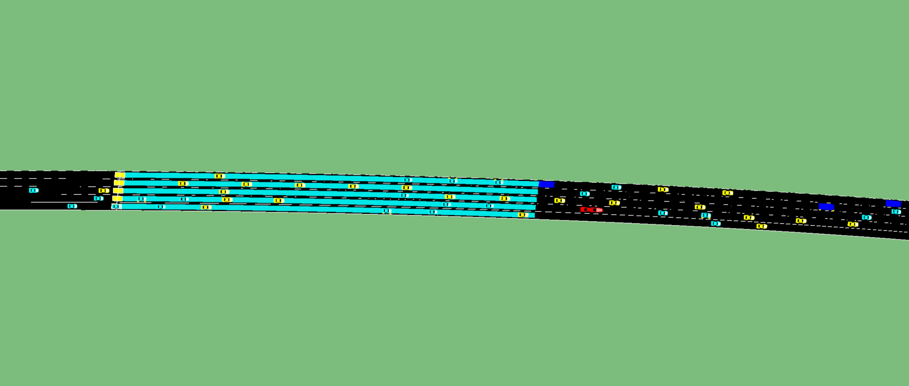

# Epressway_SUMO

# Assessing CAV Penetration Effects on a 2-km Expressway with SUMO: A Case Study

## Getting started
We simulate a 2-km limited-access expressway under CAV penetration = 25%, 50%, 75%, 100% (constant demand) and measure mobility, stability, safety surrogates, and emissions using standard SUMO outputs and virtual detectors.

To run the simulation you need to download Eclipse SUMO (Simulation of Urban Mobility) from [eclipse](https://www.eclipse.org/sumo/) or [github](https://github.com/eclipse/sumo). The provided simulation was developed and tested with SUMO 1.19.0.
## Getting started
[Eclipse SUMO](https://www.eclipse.org/sumo/)
 ≥ 1.19.0 (tested version)
Python 3.9+ (optional, for parsing & plots)
pip install pandas numpy lxml matplotlib

## Simulation setup
Network: 2-km expressway, N lanes per direction (update to your actual), posted speed V km/h.

Scenarios: CAV penetration = 25%, 50%, 75%, 100% (mix sampled at vehicle departure).

Vehicles:

HDV (human-driven): standard Krauss-family parameters (e.g., tau, sigma, accel, decel, minGap).

CAV: tighter time gap (tau ↓), smaller minGap, higher accel for ACC/CACC-like behavior.

(If you use platoons, note: platoon = a tight, coordinated group of vehicles traveling with small headways.)

Duration: 10–15 min warm-up (not recorded) + 60 min data collection.

Timestep: e.g., --step-length 0.1 (update to your exact value).

Randomness: fixed --seed; recommend R=10 replications per scenario.

## Outputs enabled (per scenario):

### tripinfo.xml: 
per-vehicle travel time, delay, route length, speed.

### summary.xml: 
network means & halts per step.

### fcd.xml: 
per-step trajectories (time, x, y, speed, accel).

### emission.xml: 
fuel, CO₂, NOx, PMx, HC (HBEFA-based).

### Induction loops: 
spot flow/speed/occupancy.

### Lane-area detectors: 
density/occupancy proxies by segment.

## Licence

SUMO is available as open source under the Eclipse Public License 2.0. For more detailled information check [LICENSE](LICENSE). 
